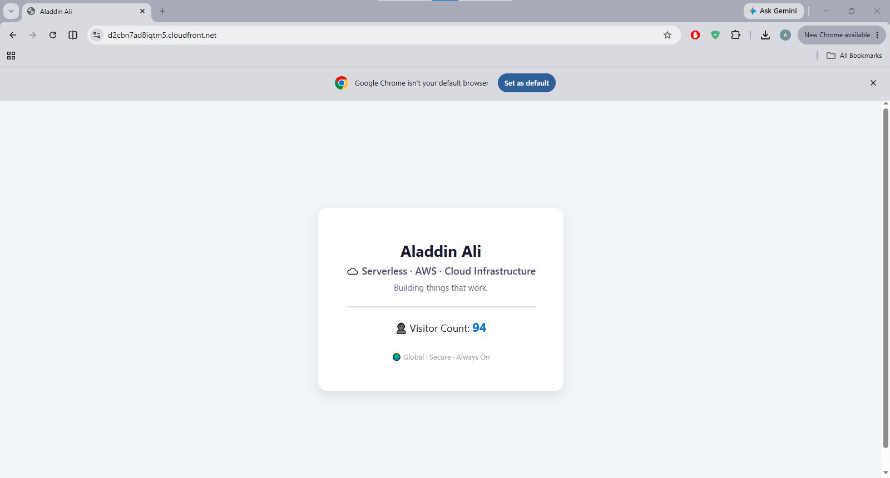

# Serverless Infrastructure on AWS

Hello and welcome to my Project. I will preface by saying this, "This is not just a visitor counter on the exterior."

As we dive deeper into the architecture, the real work is a private S3 bucket secured with Cloudfront and OAC (Origin Access Control), a severless REST API built with Lambda and API Gateway. A DynamoDB backend- all connected by applying least-privilege IAM policies and provisioned through Terraform.  

 

 

**Live Demo:** https://dczebdn2hrm2o.cloudfront.net

  
   
  <em>Screenshot of my website.</em>

---

## Architecture

- **Frontend:** S3 + CloudFront (HTTPS, global CDN, private origin)
- **Backend:** Lambda (Python) + API Gateway
- **Database:** DynamoDB
- **Security:** CloudFront OAC, IAM least privilege, private S3

---

## How It Works

1. User visits the website.
2. JavaScript in the frontend sends a request to the API Gateway endpoint to fetch the current visitor count.
3. Lambda function reads visitor count from DynamoDB, increments it, and saves it.
4. Updated count is returned and displayed on the page.

---

## Tech Stack

- AWS (S3, CloudFront, Lambda, API Gateway, DynamoDB, IAM)
- Python 3.12
- HTML / CSS / JavaScript
- Git & GitHub
- Terraform

---

## Author

**Aladdin Ali**  
[LinkedIn](https://linkedin.com/in/aladdin-ali) | [GitHub](https://github.com/aladdinali0)
