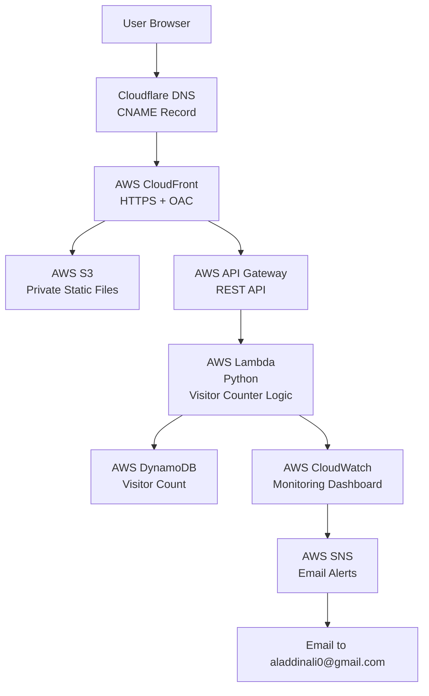

# Serverless Infrastructure on AWS

Hello and welcome to my Project. I will preface by saying this, "This is not just a visitor counter on the exterior."

As we dive deeper into the architecture, the real work is a private S3 bucket secured with CloudFront and OAC (Origin Access Control), a serverless REST API built with Lambda and API Gateway. A DynamoDB backend- all connected by applying least-privilege IAM policies and provisioned through Terraform. 

To ensure consistent, auditable, and repeatable deployments, a fully automated CI/CD (GitHub Actions) runs terraform plan on every pull request and automatically applying changes on merge to main.

Observability is done via CloudWatch for real time metrics and SNS email alerts to immediately let me know if the Lambda function has any issues. 

The frontend is a React SPA (Single Page Application) hosted in S3, delivered globally via CloudFront, with the custom domain secured through ACM and Cloudflare DNS.

 

 

**Live Demo:** https://www.aladdincloud.ca/

  
   
  <em>Screenshot of my website.</em>

## Architecture

#### This follows the JAMstack pattern: a static React frontend served via CDN, with a fully decoupled serverless API backend.

#### For the architecture, it's a cheap serverless pay-per-use model, ensuring near-zero cost during low traffic while being ready to scale seamlessly.
---

## How It Works

1. User visits the website.
2. JavaScript in the frontend sends a request to the API Gateway endpoint to fetch the current visitor count.
3. Lambda function reads visitor count from DynamoDB, increments it, and saves it.
4. Updated count is returned and displayed on the page.

---

## Services

- **Frontend:** S3 + CloudFront (HTTPS, global CDN, private origin)
- **Backend:** Lambda (Python) + API Gateway
- **Database:** DynamoDB
- **Security:** CloudFront OAC, IAM least privilege, private S3
- **Monitoring:** CloudWatch, Lambda Invocations, Lambda Errors, Period every 5 minutes (300 seconds)
- **SNS Email Alerts** 
- **Certificate Manager (ACM)**

## Tech Stack
- AWS (S3, CloudFront, Lambda, API Gateway, DynamoDB, IAM, CloudWatch, ACM, SNS)
- Python 3.12
- React (JavaScript), HTML5, CSS3, Node.js (npm)
- GitHub Actions
- Terraform
- CloudFlare DNS

---

## Author

**Aladdin Ali**  
[LinkedIn](https://linkedin.com/in/aladdin-ali) | [GitHub](https://github.com/aladdinali0)
